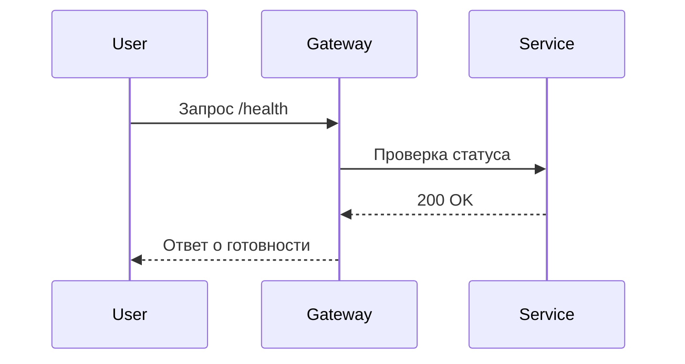

# Примеры возможностей Material

Ниже представлены примеры компонентов Material с пояснением назначения, конфигурации и визуального эффекта. Все примеры работают из коробки с указанными расширениями.

## Заметки и предупреждения

**Назначение:** акцентировать внимание на важных блоках или рисках. Используются для SLA, ограничений, рекомендаций.

```markdown
!!! warning "Производственный контур"
    Настройки ниже применяйте **только** в тестовой среде. В проде используйте утверждённый playbook.
```

Визуальный эффект: жёлтая рамка с иконкой предупреждения, блок выделяется среди текста и поддерживает сворачиваемое состояние при использовании `???` синтаксиса.

## Вкладки (tabs)

**Назначение:** показать разные варианты одной инструкции (операционные системы, роли, версии API) без дублирования страниц.

```markdown
=== "Linux"
    ```bash
    sudo systemctl restart service
    ```
=== "Windows"
    ```powershell
    Restart-Service -Name "Service"
    ```
```

Визуальный эффект: компактные переключаемые вкладки, состояние вкладки сохраняется при переходе по ссылкам благодаря `content.tabs.link`.

## Кодовые блоки с подсветкой и подсказками

**Назначение:** показывать примеры кода с подсветкой, нумерацией строк и копированием одним кликом.

```markdown
```python hl_lines="2 5" title="client.py"
import requests

response = requests.get("https://service.internal/api")
response.raise_for_status()
print(response.json())
```
```

Визуальный эффект: подсветка синтаксиса, выделение ключевых строк, кнопка копирования в правом верхнем углу.

## Диаграммы Mermaid

**Назначение:** визуализировать процессы, архитектуру и последовательности без внешних изображений.

```markdown

```

Визуальный эффект: встроенная диаграмма последовательностей, реагирует на переключение светлой/тёмной темы.

## Галерея изображений с `glightbox`

**Назначение:** показывать интерфейсы, схемы и скриншоты без перегрузки страницы.

```markdown
{ .glightbox }
```

Визуальный эффект: при клике изображение открывается в оверлее с навигацией и подписью.

## Списки действий и чек-листы

**Назначение:** структурировать последовательные шаги и контрольные пункты для playbook’ов.

```markdown
- [x] Проверить последние алерты
- [ ] Создать инцидент в системе тикетов
- [ ] Сообщить владельцам сервиса
```

Визуальный эффект: интерактивные чек-боксы (отмечаются вручную читателем), помогают отслеживать прогресс.

## Скрываемые детали

**Назначение:** убирать вглубь подробные справки, оставляя страницу компактной.

```markdown
??? note "Как собирается метрика uptime"
    Uptime вычисляется на основе логов балансировщика и статусов сервисов в Prometheus.
```

Визуальный эффект: аккуратный раскрывающийся блок, читатель разворачивает только при необходимости.
